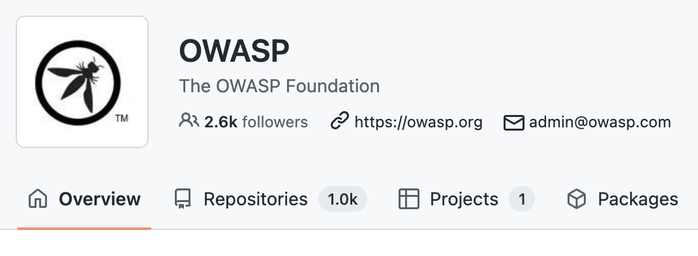

# AJAX Security Cheat Sheet
## Шпаргалка по AJAX от Owasp

### Что это?
Документ-инструкция с самой подробной информацией о конкретных фреймворках и технологиях используемых в AJAX (Asynchronous Javascript and XML).

### Что ценного?
Open Source библиотека документов, покрывающая наибольшее количество всех ценных деталей, связанных с AJAX

### Кому подойдет?
Людям, авктивно работающим в веб-разработке, нуждающимся в регулярном активном обновлении знаний по основным техническим аспектам.

### Ссылки
[Документ](https://cheatsheetseries.owasp.org/cheatsheets/AJAX_Security_Cheat_Sheet.html)  
[Гитхаб](https://github.com/OWASP/CheatSheetSeries)