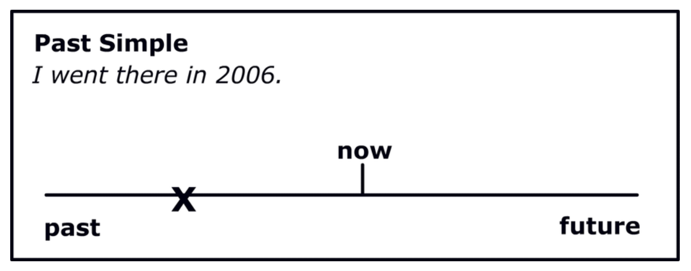

# К.У.Ч.А.
## Как Учить Чёртов Английский

### Что это?
Документ-инструкция с советами twitter-пользователя DOKTOR по изучению английского языка

### Что ценного?
Разбор основных грамматических конструкций в английском языке с практическими примерами и схемами

### Кому подойдет?
Людям технического склада ума, которым чаще всего тяжело даются лингвистические конструкции.

### Ссылки
[Гугл-док](https://docs.google.com/document/d/1XAwAedzgds_8ghvDGEaN4T4WgZ6w8s-V/edit)
[Автор](https://twitter.com/IAMTHEDOKTOR_RU)