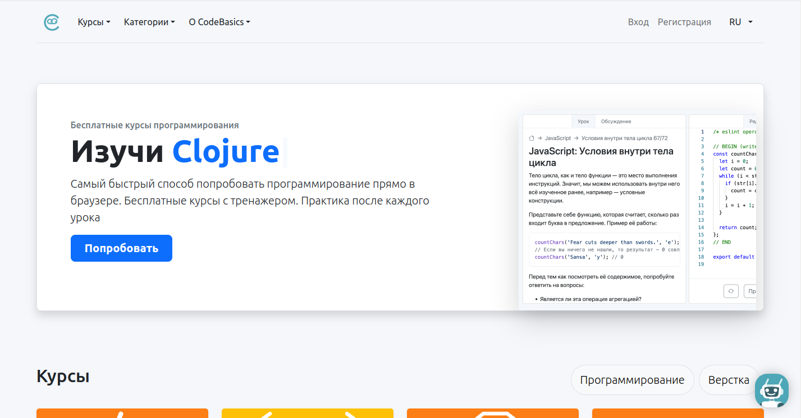

# Code-basics
## Бесплатные курсы программирования

### Что это?
Полностью бесплатная платформа для изучения основ программирования с нуля. Создан разработчиками и сообществом Хекслет, чтобы любой мог попробовать себя в программировании и заложить правильный фундамент для новой профессии, основанный не на запоминании специфики, а на понимании системы в целом.

### Что ценного?
Самый быстрый способ попробовать программирование прямо в браузере. Бесплатные курсы с тренажером. Практика после каждого урока. Так же Code-basics - это Open source проект и любой желающий может поучаствовать в написании уроков и исправление опечаток. Т.е. подойдет не только тем, кто изучает программирование, но и тем, кто хочет научить всяким разным языкам

### Кому подойдет?
Всем, кто начинает изучать программирование с нуля, вне зависимости от возраста и актуальной профессии.

### Ссылки
[Сайт](https://code-basics.com/ru)
[Гитхаб](https://github.com/hexlet-basics)