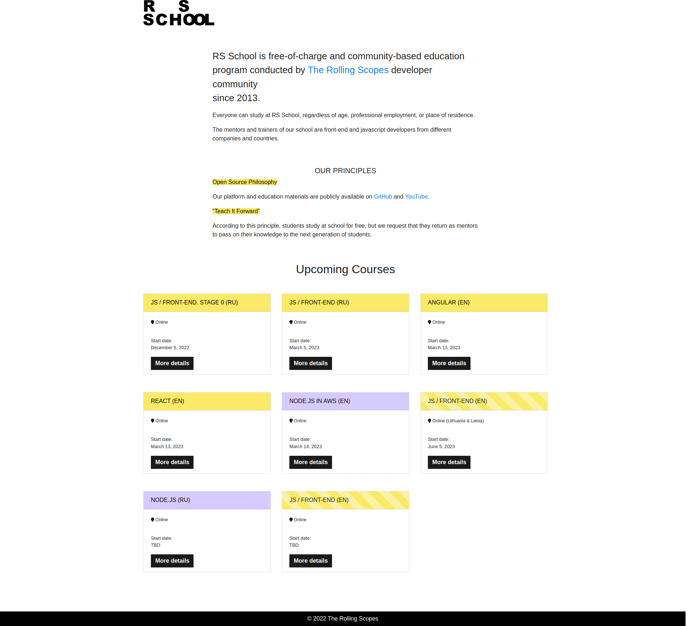

# The Rolling Scopes School
## Бесплатная школа Front-end разработки

### Что это?
Это бесплатная комьюнити школа от сообщества The Rolling Scopes. В RS School может учиться каждый, независимо от возраста, профессиональной занятости и места жительства. В обучении участвуют разработчики-волонтеры из различных компаний и стран. Менторы школы обучают студентов в свое свободное время и бесплатно!

### Что ценного?
- Абсолютно бесплатно и не требует никаких вложений.
- Получение студентами знаний и опыта, достаточного для трудоустройства на позицию Junior Software Engineer в области Front-end / JavaScript.
- Возможность развить навык прохождения собеседований, так как в процессе обучения у студентов будет возможность пройти как минимум 2 собеседования.

### Кому подойдет?
Всем, кто хочет изучить язык программирования Javascript и в будущем стать Front-end разработчиком.

### Ссылки
[Сайт](https://rs.school/)

[Документация](https://docs.rs.school/#/)

[Github](https://github.com/rolling-scopes-school)