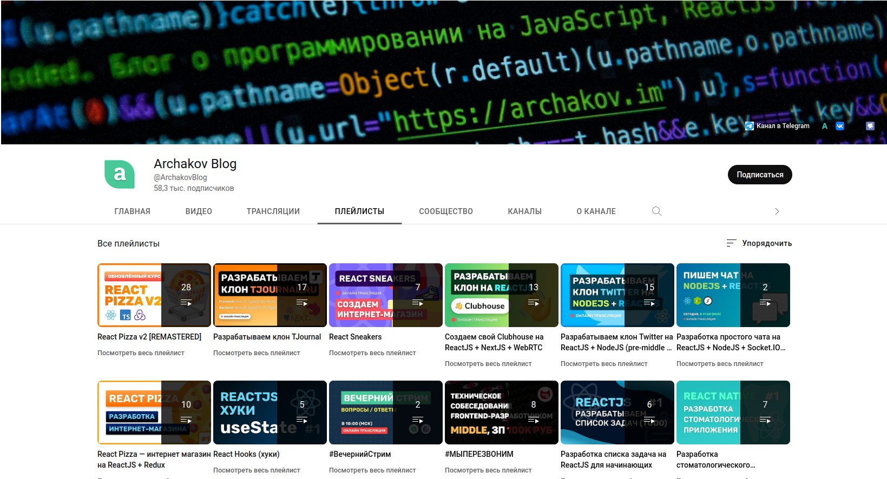

# Archakov Blog
## Канал Fullstack разработчика с полезными мини-курсами

### Что это?
YouTube-канал с интересными и полезными мини-курсами для Front-end и Back-end разработчиков на Javascript.

### Что ценного?
Актуальные серии образовательных видео, в которых автор максимально доступно и понятно объясняет базовые принципы работы с библиотекой ReactJS и платформой NodeJS.

### Кому подойдет?
Тем, кто только начинает свой путь в использовании библиотеки ReactJS и платформы NodeJS. По заявлению автора, подходит Junior/Junior+/Middle- разработчиков.

### Ссылки
[YouTube](https://www.youtube.com/@ArchakovBlog)  

[Авторский сайт](https://archakov.im/)

[Telegram-канал](https://t.me/archakovblog)