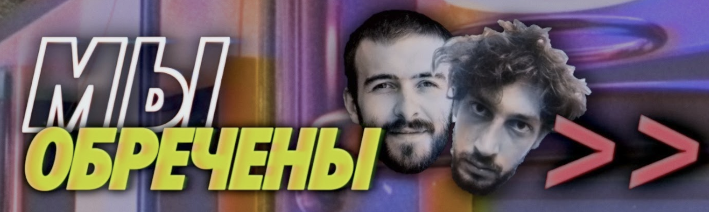

# Мы Обречены
## Лучший бесполезный ИТ-подкаст

### Что это?
Журналист Артем Малышев и программист Фил Ранжин ищут смысл в индустрии информационных технологий

### Что ценного?
Большое количество интересных гостей самых разных взглядов и мыслей. Подкаст фокусируется не столько на технологиях и программировании, сколько на личных историях - открыто, честно, без приукрас.
### Кому подойдет?
Программистам, разработчикам - для расширения кругозора. Людям вне айти - для разрушения мифов о мире АйТи и знакомства со сферой.

### Ссылки
[Ютуб](https://www.youtube.com/@myobrecheny)
[Твиттер](https://twitter.com/myobrecheny)